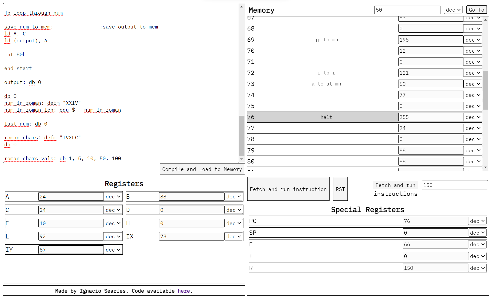

# Zilog Z80 Assembler and Emulator

A javascript implementation of the classic Zilog Z80 CPU.

[Link to the assembler/emulator](https://ignaciosearles.github.io/Z80-AssemblerAndEmulator/)

### Note

Not every instruction was tested. Please report if you encounter any issues.
