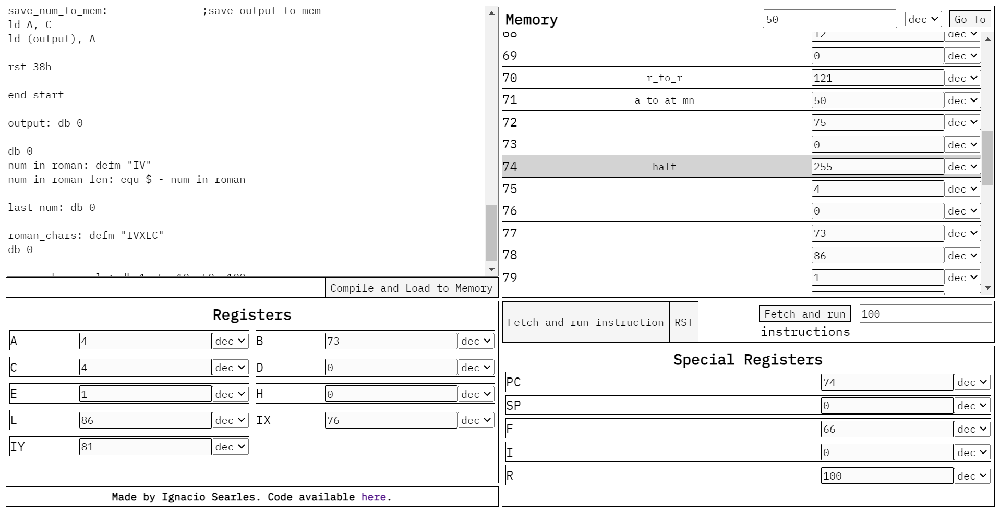

# Zilog Z80 Compiler and Emulator

A javascript implementation of the classic Zilog Z80 CPU.

[Link to the compiler/emulator](https://ignaciosearles.github.io/Z80-CompilerAndEmulator/)

### Note

Some instructions are still missing. Not every instruction was tested.
